# Walking Tours — AI-guided audio walking tours for Android

A native Android app that does what a human free-walking-tour guide does: it knows where you are,
tells you what you are looking at when you arrive, and then walks you to the next thing.

This repository contains a complete, working MVP with one fully authored tour of Istanbul:
**14 stops, 3.4 km, from the Roman Hippodrome to the ferry piers at Eminönü.**

| Tour list | Itinerary map | Geofenced arrival |
|---|---|---|
| 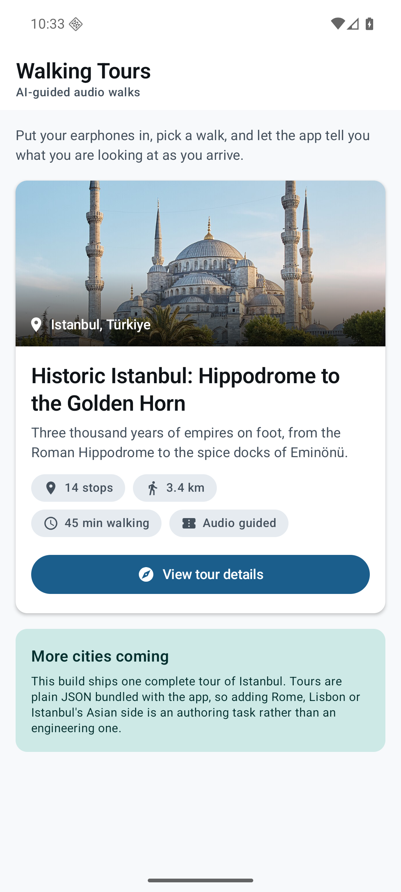 | 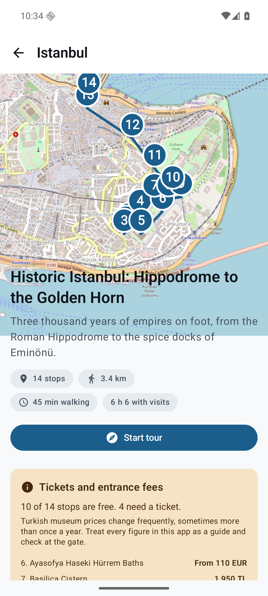 | 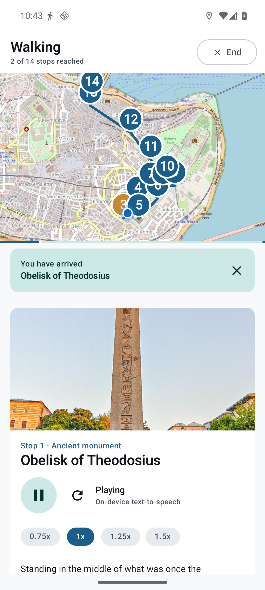 |

| Stop detail | Visitor info & credits |
|---|---|
| 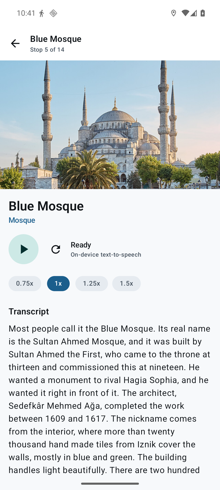 | 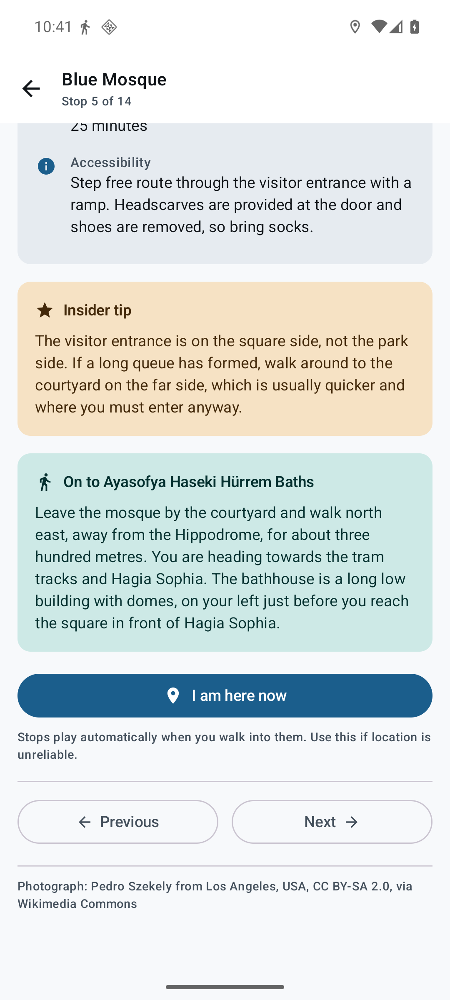 |

---

## Answering the requirements question first

**The core app needs no API keys and costs nothing to run.** Not "free tier" — genuinely free, with
no account to create:

| Capability | How it is done | Cost |
|---|---|---|
| Map tiles | OpenStreetMap via osmdroid | Free, no key |
| Audio narration | The phone's own text-to-speech engine | Free, no key, works offline |
| Database | Room / SQLite, bundled in the APK | Free |
| Location & geofencing | Android `LocationManager` — **no Google Play Services dependency at all** | Free |
| Photographs | Wikimedia Commons, CC/PD licensed, bundled in the APK | Free |

The app runs on any Android 8.0+ device, including phones with no Google services.

### The optional Google upgrades

Two features are switched off by default and become available when you add a Google API key. Both
have a monthly free allowance that comfortably covers personal use of this tour, and both are
entirely your choice:

| Upgrade | What it adds | Needs |
|---|---|---|
| **Cloud narration voice** | Chirp 3: HD voices — dramatically more natural than the on-device voice, with an in-app voice picker | Cloud Text-to-Speech API key, billing enabled on the project |
| **AI travel assistant** | Ask questions about any stop or the tour; grounded in the tour content and constrained to travel topics; can read answers aloud | Gemini API key (free tier available) |

**If you never add a key, nothing breaks and nothing is charged.** The app falls back to the
on-device voice automatically, and the assistant simply shows a card explaining what to add.

Full step-by-step console instructions, including how to lock the keys down:
**[GOOGLE_SETUP.md](GOOGLE_SETUP.md)**.

### The map has two paths, and the Google one is build-time only

The itinerary map is OpenStreetMap by default and needs nothing. If `google.maps.apiKey` (falling
back to `google.api.key`) is present in `local.properties` **when the app is built**, the same
itinerary is drawn by Google Maps instead, with the real walking route through the stops from the
Directions API. Routes are cached in memory only and never written to disk or bundled into the app's
JSON, because Google's terms do not allow storing Directions content.

This key is not like the other two: the Maps SDK reads it from the manifest
(`com.google.android.geo.API_KEY`, filled from `BuildConfig.GOOGLE_MAPS_API_KEY` at build time), so
it cannot be typed into the in-app Settings screen — rebuild with the key in place. Leave it out and
the app renders the osmdroid map exactly as before; there is no half-configured grey map.

### Other costs to be aware of later

1. **Google Maps SDK**, if you want that specific look and the real walking-route line. Requires a
   Google Cloud project with **billing enabled**, which is exactly why the app uses OpenStreetMap by
   default and only opts in when you build a key in.
2. **Google Play publishing** — a one-time **$25** developer registration, if you ship it publicly.
3. **A backend proxy for the API keys.** Any key inside an Android app can be extracted. Key
   restrictions (package name + signing certificate) make that much harder and are what the app
   supports today, but before shipping to other people the keys should live behind a small server.
4. **OpenStreetMap tile policy at scale.** The public `tile.openstreetmap.org` servers are
   donation-funded and have an acceptable-use policy. This is completely fine for development and
   for a modest number of users, but if the app gets popular you should move to a commercial tile
   provider (Mapbox, Thunderforest, Stadia — roughly $0-50/month at low volume) or self-host.
   osmdroid takes a different tile source in one line.
5. **Content authoring** — writing more tours, or recording studio audio instead of TTS.

---

## Build and run

Requirements: JDK 17+, Android SDK with platform 37 and build-tools 36+.

```bash
# Build the debug APK
./gradlew :app:assembleDebug

# Install onto a connected device or emulator
adb install -r app/build/outputs/apk/debug/app-debug.apk
```

The APK lands at `app/build/outputs/apk/debug/app-debug.apk` (~26 MB, including 14 bundled
photographs).

### The two devices

Development uses an emulator for automated checks and the owner's Galaxy S25 for real use.

| | Device | Used for |
|---|---|---|
| Emulator | `emulator-5554` | Anything needing a controllable position, plus the checks that should not disturb a real phone |
| Phone | `RQGYA027GQR` | **Every build gets installed here**, so the newest is always to hand; testing on it is the owner's to do |

Two rules when installing on the phone:

- **Use `install -r`** (and `-g` for runtime permissions). Never `pm clear` — the Google API keys
  live in the app's `SharedPreferences`, and clearing wipes them.
- **Install the debug build.** The API keys are registered in Google Cloud against the debug signing
  SHA-1, so a release build loses access to Cloud TTS and Gemini until the release key is registered
  too.

Grant location permission when asked — the app requests it at the moment you tap **Start tour**,
not at launch, so the request has obvious context.

### Verifying geofencing without walking around Istanbul

The emulator can be told where it is, which makes the whole trigger chain testable:

```bash
# The obelisk: note adb emu geo fix takes LONGITUDE first
adb emu geo fix 28.975397 41.005900
adb logcat | grep TourSession        # -> "Arrived at Obelisk of Theodosius"
```

---

## What the app does

**Tour list.** Each tour shows a photograph, a one-line summary, stop count, distance, walking time
and total time including visits.

**Tour detail.** The itinerary drawn on an OpenStreetMap map with numbered pins and a route
polyline, the full stop list, total walking time, and a ticket summary that totals up which stops
are free and which are ticketed with indicative prices and an honest warning that Turkish museum
prices change often.

**Active tour.** The screen you keep open while walking:

- **Starting a tour opens with a spoken introduction to the city** — audio *and* text, with the same
  highlighting, before any geofence is armed. Geofencing switches on the moment it finishes, and the
  walker's position is evaluated at that instant, so someone who presses Start while already standing
  at stop one still hears it immediately.
- A **ring beside the stop's name**, holding the stop's number until it is ticked, then filling in
  with a checkmark and a little spring so it feels like something happened. The number fades out as
  the fill sweeps over it, so it reads as one object changing state. A stock Material checkbox reads as a form field, which
  is the wrong language for a travel guide; a ring that fills in is closer to the tick a printed
  guidebook leaves in the margin. It works before the trip as well as during it, and replaced a
  dedicated "I am here now" button that only made sense on location.

  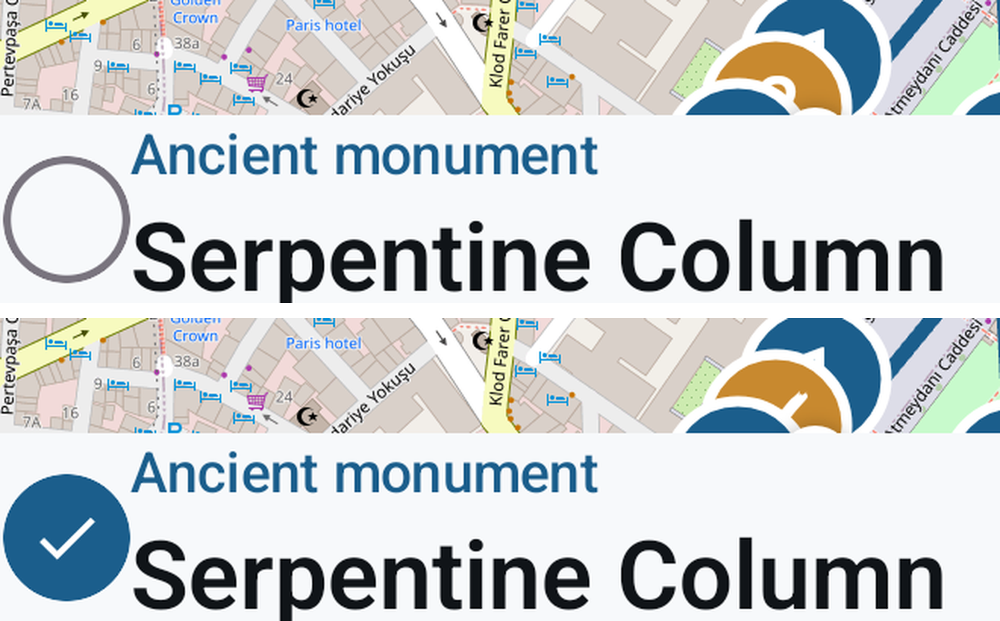
- The stop page's map **frames exactly this stop and the next one** — at the closest zoom that still
  holds both points, with padding sized to a marker rather than to the generous margin the overview
  wants, and with no artificial zoom ceiling. The useful question on a stop page is "where do I go
  next", and the answer should fill the view.

  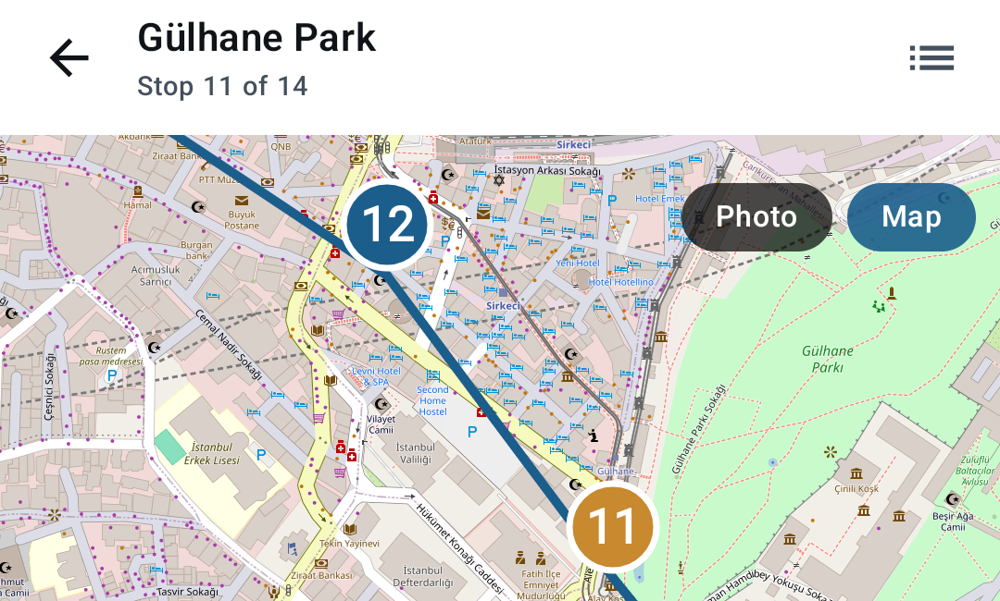
- **Swipe sideways to move to the previous or next stop.** The hero's photograph and map are switched
  with their chips instead, because two horizontal gestures on one screen would be ambiguous and one
  of them would silently win.
- **You can join the tour at any stop.** "Start the tour from here" on a stop begins immediately at
  that stop, with no introduction and no walking back to stop one. Nothing about the tour assumes you
  began at the beginning.
- **Guidance always aims at the nearest stop still to see**, not the next one in route order — so
  joining half way through, or wandering off the route, both behave sensibly.
- A map with your live position, drawn Google Maps style: a blue dot on a white ring, a translucent
  accuracy circle, and a **cone showing which way the compass says you are facing**.
- **Walking into a stop triggers its narration automatically**, with no interaction at all.
- An arrival banner, the stop photograph, and the transcript.
- A "walk to stop N" card giving distance, compass bearing and estimated walking time.
- A jump list so you can listen to any stop from anywhere.
- A **docked ask bar** for the AI assistant, and a **persistent media notification** you can control
  from the lock screen.

**Media notification.** Starting a tour posts a Spotify-style persistent media card:

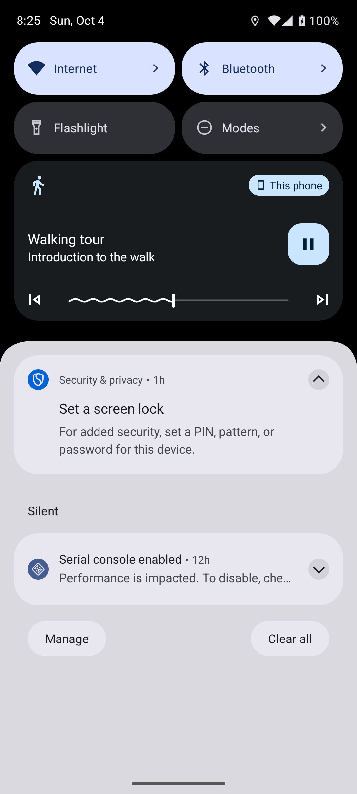

- Play and pause, previous stop and next stop, and a **fifteen-second rewind**.
- A **seek bar** that tracks and scrubs the narration.
- The stop photograph as artwork, and the current stop name.
- Driven by a real `MediaSession`, so the same controls appear on the lock screen and in the car, and
  the platform handles media keys. The session publishes position, duration and playback speed, which
  is what lets Android's system media control interpolate a smooth seek bar without us pushing an
  update ten times a second.

### Details worth knowing about

**Stop detail.** The reference page for one stop. Photograph and map in **one swipeable hero**, with
a toggle for people who would rather tap than swipe. Then the full transcript, playback controls, the
visitor information (entrance fee, opening hours, suggested time, accessibility), an insider tip,
spoken directions to the following stop, and previous/next navigation.

### One stop screen, not two

There used to be a separate screen for "resume tour" and for tapping a stop from the overview. They
showed the same photograph, the same map, the same transcript and the same controls, and differed
only in that one of them knew a tour was running — which made the pair read as duplicates. They are
now a single screen. The walking-only parts simply appear when a tour is active:

| | Browsing a stop | Same screen, tour running |
|---|---|---|
| App bar | "Stop 7 of 14" | "Walking · 3 of 14 reached", plus **End** |
| Hero | Photograph first | Map first |
| Extra | "Start the tour from here" | Arrival banner, walk-to-next guidance with live distance, "I am here now" |

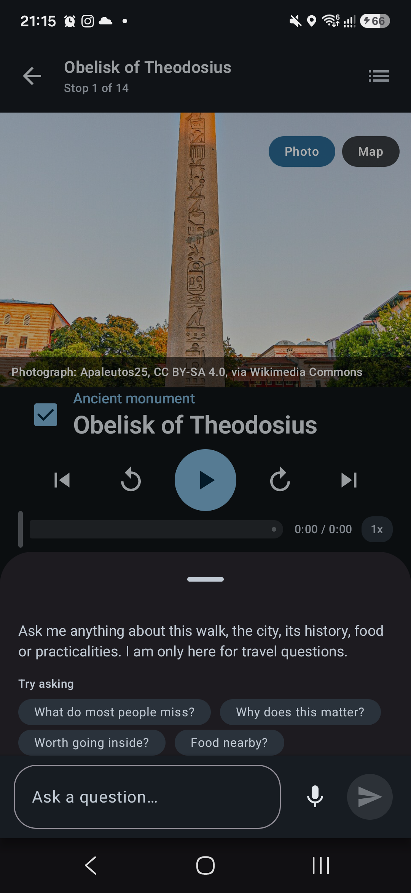 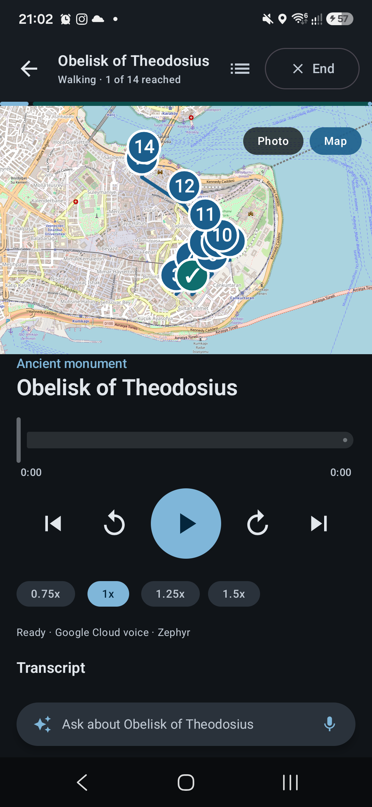

### The base map

The fallback map — the one used when no Google Maps key is present — is the **standard
OpenStreetMap style**, and it carries hotel, restaurant and shop icons.

Those icons are baked into the raster tiles: they are pixels, not layers, so no amount of overlay
work removes them. Two cleaner styles were tried and both had to be reverted, which is worth
recording rather than rediscovering:

| Style | Why it was reverted |
|---|---|
| CARTO Positron | Every tile now returns a watermark reading **"API KEY REQUIRED"** — the free tier is gone |
| Esri Light Gray Canvas | Clean and POI-free, but it **stops at zoom 16**. The two-stop camera fit deliberately zooms as far in as both stops allow, so it ran straight past the last available tile and filled the screen with "Map data not yet available" at exactly the zoom the walker most wants to read |

A map that renders everywhere beats a map that looks tidy until you zoom in. The clean basemap comes
from the **Google Maps path** instead, which has no such ceiling.

### Where the walker is

The blue dot used to appear only during a tour, because only the tour ever started the location
tracker — so browsing a stop to read about it showed a map with no "you are here" on it at all, and
the tour overview map never had one. Position updates are now **reference counted**: the tour holds
one lease while it runs and every screen showing a map holds another, so the dot is there on every
map, and closing a screen can never silently stop a running tour's geofences.

One bug worth recording, because the symptom was misleading: after adding the dot to the overview map
it still did not appear, and the map was blamed. The dot *was* being drawn — underneath the numbered
stop markers. osmdroid draws overlays in list order, and the route effect re-runs whenever progress
changes, re-adding the stop markers after the walker's marker and burying it. The dot is now moved
back to the end of the overlay list.

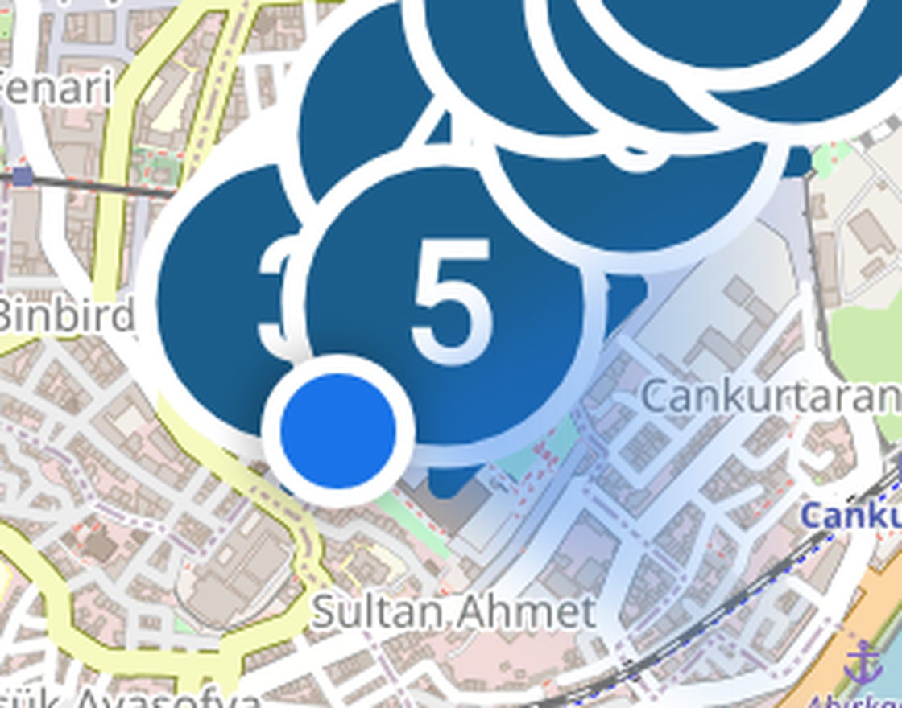

The marker follows Google Maps' current design: a long, soft, translucent heading cone with the blue
dot on a white ring at its apex.

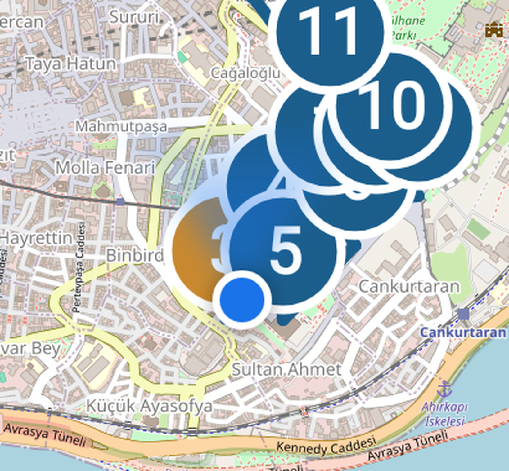

The cone is only drawn when there is a heading to rotate it by. A cone always points "up" in its
bitmap, so with no heading it would sit there claiming the walker faces north.

It also **moves** rather than jumping. Two separate causes of jitter were fixed:

| Cause | Fix |
|---|---|
| The compass jittered by several degrees per sample and the cone twitched | Time-based one-pole low pass (about half a second), a one-degree deadband so identical cones are not redrawn, and heavier filtering when the platform reports the magnetometer as poorly calibrated |
| Each GPS fix snapped the dot to a new position | The marker is created once and its position and rotation are **animated** — 900 ms and 700 ms respectively — instead of being torn down and rebuilt per fix |

A note on the compass: suppressing the heading when the platform calls it unreliable was the
obvious approach, and it was wrong. An unreliable magnetometer is common and momentary — indoors,
near metal, before the phone has been calibrated — and a cone that blinks in and out is worse than
one that turns slowly. Smoothing fixes the jitter; hiding does not.

### Navigation, the back button, and transitions

Two separate problems here, and the first was not an animation problem at all.

**The back button replayed the whole journey.** Stepping between stops — by swipe, by the transport's
previous/next, or from the All stops list — pushed a *new* stop destination each time. After swiping
through six stops the back stack held six stop pages, so back walked you through the trip one stop at
a time instead of returning to the tour. Moving between stops now **replaces** the stop page rather
than stacking another one. Verified on device: swiping through several stops and pressing back once
lands straight on the tour overview.

"Start the tour from here" had the same fault from the other direction: it pushed a second copy of the
stop page you were already looking at. It now starts the tour in place.

**The transition itself barely moved.** The previous version slid each screen only a fifth of a width
and leaned on a fade to cover the rest, so screens appeared to dissolve in place. It now uses the
standard push: the incoming screen travels a **full width** while the outgoing one parallaxes a third
of the way out, and back is the exact reverse.

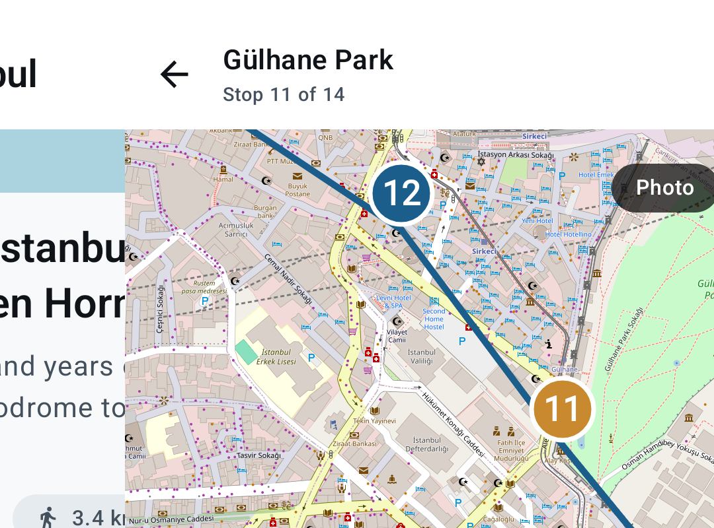

#### Leaving a stop

Backing out of a stop page **stops the narration**. Walking away from the tour is a decision to stop
listening, and leaving it talking to an empty pocket is worse than stopping a fraction too eagerly.
Putting the app in the background is the deliberate exception — that keeps playing, because that is
what you do when you pocket the phone mid-walk. Verified on device: audio continues after Home and
stops on back.

The toolbar's **End** button is gone; back does the same job, so the button was a second way to do
one thing.

#### Attribution

The stop photographs' credits no longer appear under every photograph. They are Creative Commons or
public domain, which **requires** attribution, so they have not been removed — they are collected
into a **Photograph credits** card in Settings, out of the reading flow but still present.

Stepping to the previous stop now brings that screen in from the **left**, exactly as stepping to
the next one brings it in from the right — the navigation carries a direction flag so the swipe
slides the way the walker is moving.

#### Known unresolved: the app-close animation

Backing out of the app itself plays Android's task-close animation — the window shrinks into a
rounded card over the launcher. It reads as the app collapsing rather than simply leaving, and it is
**not fixed**. Six approaches were tried and verified ineffective on the emulator (Android 16,
targetSdk 37):

| Attempt | Result |
|---|---|
| `android:enableOnBackInvokedCallback="false"` (confirmed present in the merged manifest) | no change |
| `Activity.overrideActivityTransition(OVERRIDE_TRANSITION_CLOSE, 0, 0)` | no change |
| `android:windowAnimationStyle` set to `@null` | no change |
| A full `Animation.Activity` style with every open/close/task entry nulled | no change |
| `moveTaskToBack(true)` on back at the root instead of finishing the activity | same animation |
| Theme parent switched from `Theme.Material` to `Theme.DeviceDefault` | no change |

The one lever not pulled is lowering `targetSdk` below 36, where `enableOnBackInvokedCallback` is
still honoured and predictive back can be switched off. That trades a real downgrade in platform
compliance for one animation, so it was left as a decision for the owner rather than taken quietly.


### The transport

Audio controls are shaped like a music player, because that is what people already know: previous
stop, rewind fifteen seconds, play/pause, forward fifteen seconds, next stop — and they are kept to a
**single row**, with the scrubber and the speed control sharing that row.

This is a guide, not a music player: the writing and the photographs are the product, and the controls
went from five stacked bands to one line. The status line ("Playing · Google Cloud voice · Zephyr") is
gone — the voice in use is a setting, not something to read while walking, and Settings still shows it.

The scrubber is a **hairline with a small dot** rather than Material's slider, whose thick track and
haloed thumb made it the loudest thing on a page that is mostly writing and photographs. Progress
still has to be visible and seekable, so it stays — just quietly.

Two details worth knowing:

- The transport icons are plain clickable boxes rather than Material `IconButton`, because that
  component enforces a 48dp minimum touch target which alone would make the row too wide to also hold
  the scrubber.
- The slider keeps its own value while being dragged. Without that, the position updates streaming
  from the player fight the thumb and scrubbing becomes impossible.

### The notification's fifteen-second buttons

The media control needs more than `PlaybackState.ACTION_REWIND` to draw a rewind button: on Android
13+ the system media card builds its extra buttons from the session's **custom actions**. Without them
the rewind existed only on the notification's own action row and was invisible in the media player.
The session now publishes both, and tapping them in the shade moves playback by fifteen seconds.

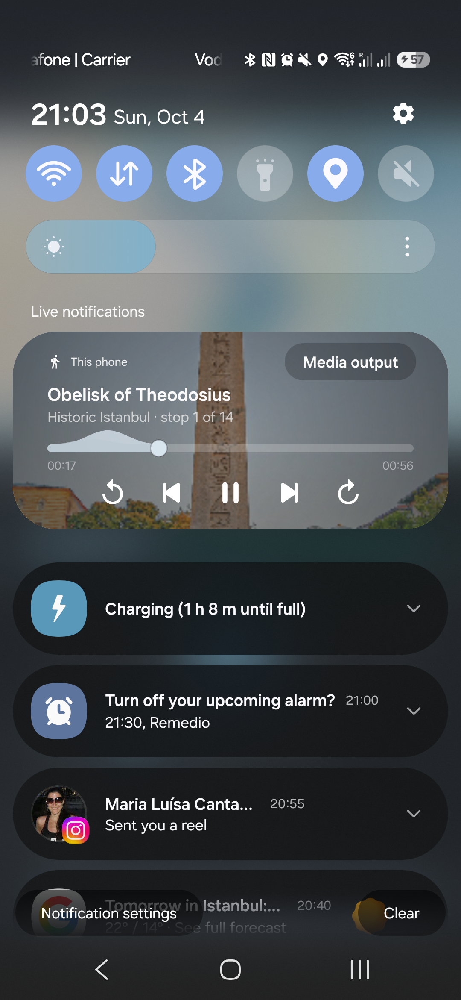

### One assistant, everywhere

The AI chat is the **same UI on every screen** — a docked ask bar at the bottom that opens the
conversation over whatever you were looking at, so the map and audio keep running. The separate
full-screen chat screen was removed once the sheet could do the job everywhere.

| Walking screen | Compact chat sheet |
|---|---|
| 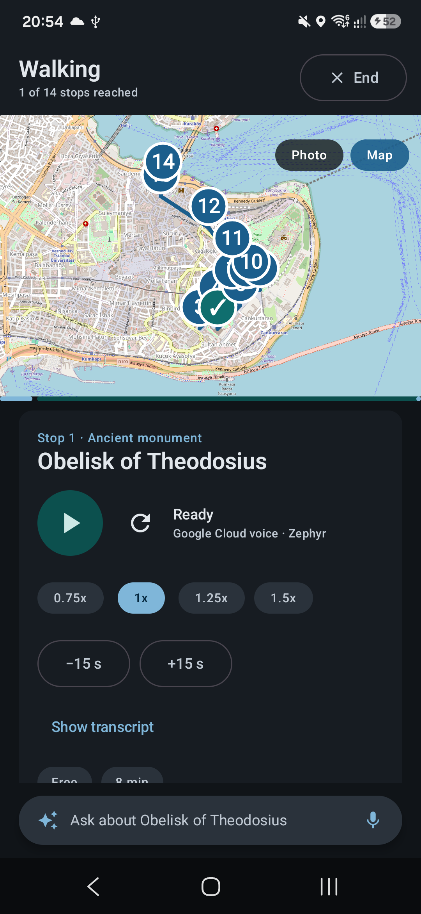 | 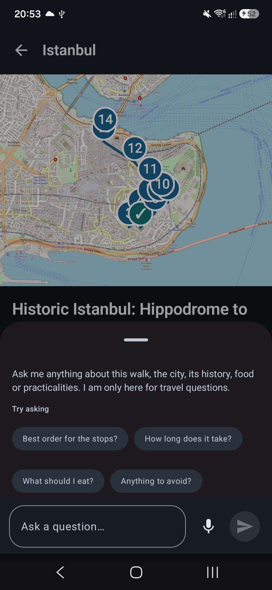 |

The sheet sizes to its content until there is a conversation to show, rather than covering the screen
before you have asked anything, and the starter questions are compact pills that sit two to a row.

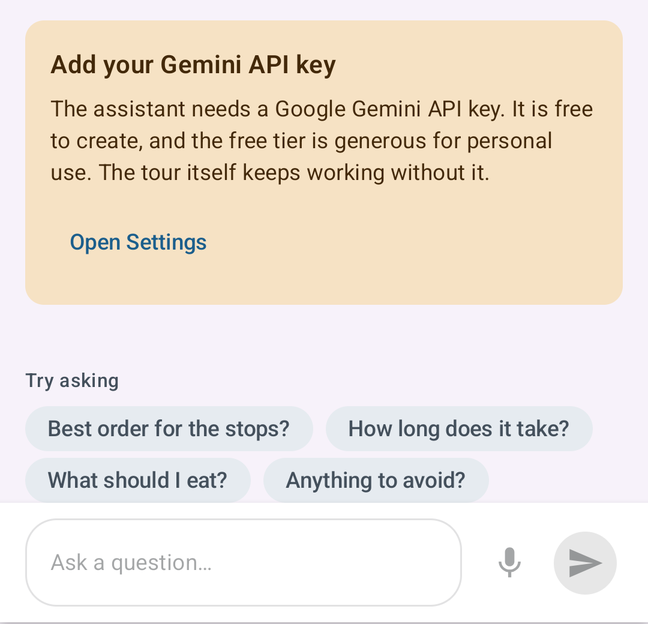

Its type and spacing were inconsistent and are now on one scale:

| | Before | Now |
|---|---|---|
| Body copy (hint, key card, answers) | mixed `bodySmall` and `bodyMedium` | `bodyMedium` throughout |
| Input field | defaulted to 16sp — larger than the answers | `bodyMedium`, matching |
| Section label ("Try asking") | `labelSmall` (11sp) | `labelMedium` |
| Starter chips | `bodySmall` (12sp) | `labelLarge` |
| "Listen" beside a 16dp icon | `labelSmall` (11sp) | `labelMedium` |
| Input row gutter | 12dp while everything else was 16dp | 16dp |
| Message bubbles | forced to 92% width, so "Yes" looked like a banner | wraps its text, capped for long answers |

| Photo / map toggle | Ask bar and chat sheet |
|---|---|
| 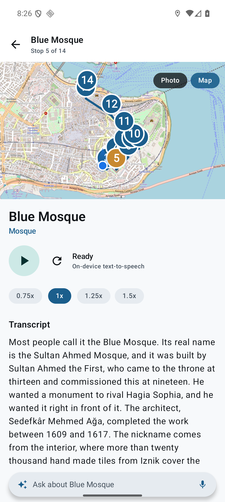 | 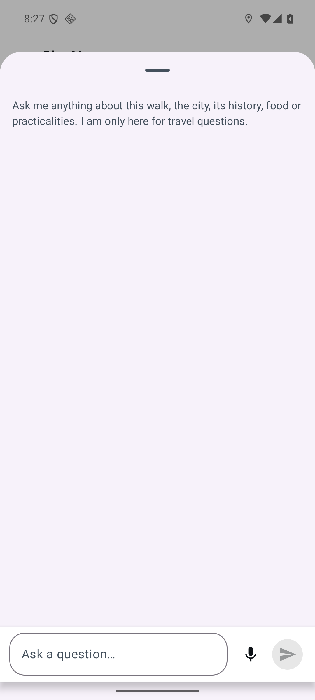 |

### Details worth knowing about

- **The transcript highlights in time with the audio.** The text-to-speech engine reports the
  character range it is speaking; the app maps that back onto the visible paragraph so the words
  light up as they are read.

  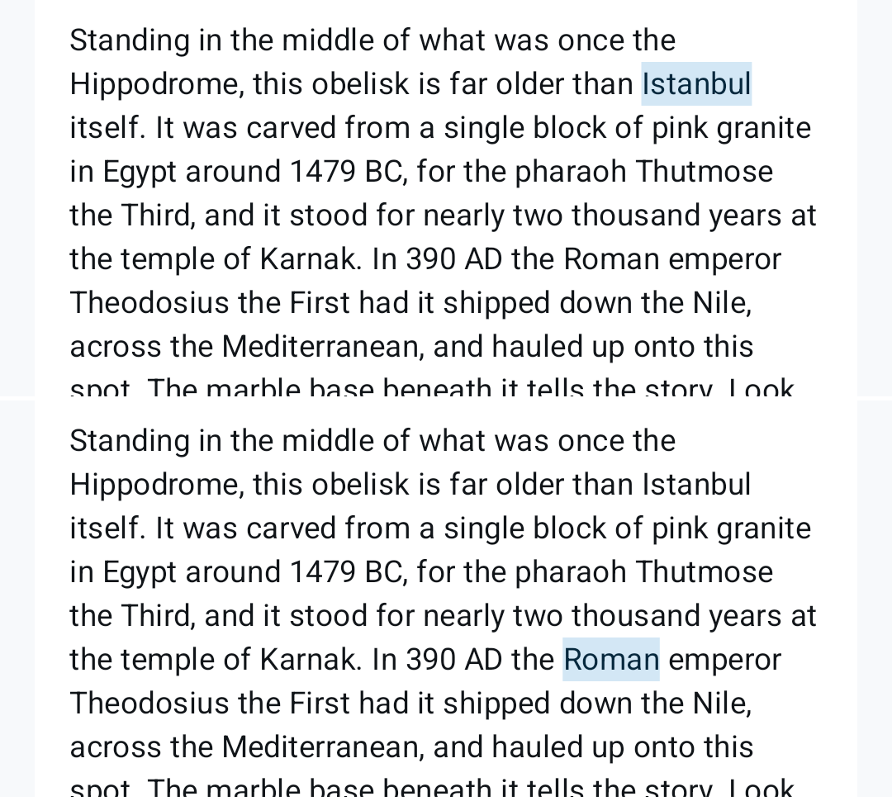

- **Turkish names are pronounced correctly.** An English TTS voice mangles *Soğukçeşme*,
  *Mısır Çarşısı* and *Hürrem*. Android TTS accepts no phonemes and no SSML, so the app builds a
  respelled "spoken script" and keeps a segment map back to the original text. The audio sounds
  right **and** the on-screen highlighting stays accurate — the two do not drift apart.
- **Playback never dies in your pocket.** Starting a tour promotes the app to a foreground service
  (type `location`), so location updates and narration survive the screen going off. Without it,
  Android freezes the process within minutes and the geofences silently stop firing.
- **Cold-start race handled.** A geofence can fire seconds after launch, before the speech engine has
  bound to its service. The play request is queued and honoured the moment the engine reports ready,
  instead of dropping the narration.
- **Landmarks avoid repeat-triggering.** Arrival fires once; re-arming requires leaving a *wider*
  radius than the one that triggered it, so GPS jitter in narrow old-city streets cannot make a stop
  flicker on and off.
- **The map owns its gestures.** These maps sit inside a scrolling page, and by default the parent
  scrollable competes for the same drag: the map starts panning, the list decides the gesture is a
  scroll, and the map snatches it back — which feels snaggy and inconsistent. A thin `MapTouchGuard`
  view asks the parent not to intercept for the duration of a gesture, so panning and pinching
  belong entirely to the map. Swiping on the page *around* the map still scrolls normally.
  The camera fit also uses a larger tile cache, so zooming in and back out reuses tiles instead of
  re-fetching them mid-gesture.
- **Closing the app silences it.** Narration is spoken by the system text-to-speech engine, which
  runs in its own process — killing our UI would not stop it, and the foreground service would
  otherwise keep narrating after a Recents swipe. The service's `onTaskRemoved`, the activity's
  `onDestroy`, and the service's own `onDestroy` all cut the audio explicitly, so swiping the app
  away or force-stopping it goes quiet immediately (verified: one active speech player while
  running, zero afterwards).

---

## Architecture

```
app/src/main/java/com/walkingtours/app/
├── ai/             Settings, HTTP + app-identity headers, Cloud TTS client, Gemini client,
│                   travel-checked chat controller
├── audio/          NarrationEngine + on-device TTS, cloud TTS, NarrationRouter, pronunciation
├── data/           Room entities, DAO, database, JSON content seeder, repository
├── location/       LocationManager wrapper + ArrivalDetector (pure geofence logic)
├── tour/           TourSessionManager — the app-scoped orchestrator
├── service/        Foreground service that keeps a tour alive
├── ui/             Compose screens (tours, map, stop, active, chat, settings), shared components
└── util/           Haversine geometry, formatting
```

Four design decisions shape everything:

**`NarrationEngine` is an interface, and `NarrationRouter` owns it for the process lifetime.** Two
implementations exist — the free on-device voice and the Google Cloud voice — and the router forwards
to whichever the user chose. That indirection is what lets the voice change at runtime without every
screen re-subscribing to a new progress flow mid-tour.

**`TourSessionManager` is app-scoped, not screen-scoped.** A tour outlives any single screen — the
user pockets the phone and keeps walking — so location, narration and progress live in one
singleton the UI merely observes. It is also the only class that knows the tour is "running".

**`ArrivalDetector` is pure.** No Android dependencies, so the geofence behaviour is easy to reason
about and could be unit tested without a device.

**The AI layer is opt-in and never in the critical path.** No screen, geofence or session touches an
API directly: the chat goes through `TravelChatController` and the voice through `NarrationRouter`.
If Google is unreachable, misconfigured or unpaid for, the tour still runs.

### Content lives as JSON, not as code

Tours are plain JSON in `app/src/main/assets/tours/`, seeded into SQLite on first launch. Adding
Rome or Lisbon is an authoring task, not an engineering one, and content diffs cleanly in review.
Seeding is idempotent, so user progress survives every subsequent launch.

```jsonc
{
  "tour": {
    "id": "istanbul-historic-peninsula",
    "title": "…", "city": "Istanbul", "summary": "…",
    "overviewText": "Spoken introduction, played before the first stop.",
    "distanceKm": 3.4, "totalWalkMinutes": 45,
    "difficulty": "…", "bestTimeOfDay": "…"
  },
  "stops": [{
    "order": 1, "id": "obelisk-of-theodosius", "name": "Obelisk of Theodosius",
    "lat": 41.005900, "lng": 28.975397,
    "narration": "Read aloud AND shown on screen.",
    "suggestedMinutes": 8,
    "entranceFeeTry": "Free", "entranceFeeNote": "…", "isFree": true,
    "openingHours": "…", "accessibility": "…", "insiderTip": "…",
    "nextStopDirections": "Spoken directions to the following stop.",
    "photoAsset": "photos/obelisk-of-theodosius.jpg",
    "photoAttribution": "Photograph: …, CC BY-SA 4.0, via Wikimedia Commons",
    "triggerRadiusMeters": 30
  }]
}
```

`triggerRadiusMeters` is tuned per stop: tight (30 m) on a crowded square where monuments stand
metres apart, generous (90 m) for a park or a whole neighbourhood.

---

## The Istanbul tour

Fourteen stops in the order requested: Obelisk of Theodosius, Serpentine Column, Obelisk of
Constantine, German Fountain, Blue Mosque, Ayasofya Haseki Hürrem Baths, Basilica Cistern, Hagia
Sophia, Topkapı Palace Museum, Soğukçeşme Street, Gülhane Park, Hoca Paşa, Egyptian Bazaar, Eminönü.

Every coordinate was cross-checked against two independent sources (Wikipedia/Wikidata **and**
OpenStreetMap/Nominatim). Standing points were chosen where a visitor actually walks — the Imperial
Gate for Topkapı, the OSM entrance node for the Basilica Cistern — rather than the geometric centre
of a building, because that is where the geofence should fire.

Two honest notes about the content:

- **The route backtracks once, and that is intentional.** The three Hippodrome monuments run north
  to south, but the German Fountain sits at the north end of the square. Following the requested
  order means retracing about 250 m. The narration says so plainly rather than pretending otherwise.
  Reordering the fountain to first position would remove the backtrack if you prefer.
- **Ticket prices are labelled as indicative, not authoritative.** Where an official 2026 price
  existed it is used; where it could not be confirmed the app says so and tells the user to check at
  the gate. Hagia Sophia's fee is set in **euros**, not lira, which the app states explicitly.

Photographs are the real thing, bundled from Wikimedia Commons. Each stop shows its
**licence and photographer**, and every image is CC-BY, CC-BY-SA or public domain — no non-free
media. Attribution is surfaced in the UI because those licences require it.

---

## Google voice and the AI assistant

Both are implemented and working, and both are optional. Setup: **[GOOGLE_SETUP.md](GOOGLE_SETUP.md)**.

### Cloud narration voice

`GoogleCloudTtsNarrationEngine` speaks through Google Cloud Text-to-Speech using Chirp 3: HD voices,
with a voice picker in Settings that lists every voice the account can use.

The design that makes a cloud voice viable on a walk:

- **Synthesise once, play many times.** Each stop's audio is cached on disk, keyed by voice and text.
  Re-listening is free, and the tour plays offline afterwards.
- **Speed is applied at playback, not synthesis** (`PlaybackParams`), so changing speed does not
  re-bill or re-download anything.
- **Fallback is automatic.** If the key is invalid, the quota is exhausted, or there is no signal, the
  `NarrationRouter` finishes the tour on the phone's voice and labels the engine
  "cloud voice unavailable". A guide that stops talking is worse than a guide with a plainer accent.
- **Highlighting still works.** Google returns no word timings for plain text, so the highlighted
  range is derived from playback position and snapped to whole words.

`NarrationRouter` exists so the whole app can hold one engine for its lifetime while the
implementation is swapped underneath. Without it, every screen and the tour session would have to
re-subscribe to a new progress flow mid-walk whenever the user changed voice.

### AI travel assistant

A chat screen reachable for a whole tour or for a single stop, with typed input and a microphone
button that dictates questions through the system recogniser.

Two things make it a *travel* assistant rather than a general chatbot:

1. **Grounding.** Every request carries the tour, the stop the walker is standing at, the narration
   they just heard, the ticket price and the directions onward — so answers agree with the tour
   instead of contradicting it, and "what did it say about the Medusa heads?" actually works.
2. **A scope rule the model enforces.** Questions outside travel and this city are declined, and the
   user is offered a travel question instead. This is prompt-level rather than a hard guarantee, and
   it is documented as such.

Answers can also be read aloud through the same voice as the tour.

The Gemini model is **discovered at runtime** rather than hard-coded. Google retires model IDs
regularly, and an app that stops answering because a pinned model was deprecated is worse than one
that asks which models the key can see and picks the best available. A specific model can still be
pinned in Settings.

| Chat, before a key is added | Voice and key settings |
|---|---|
| 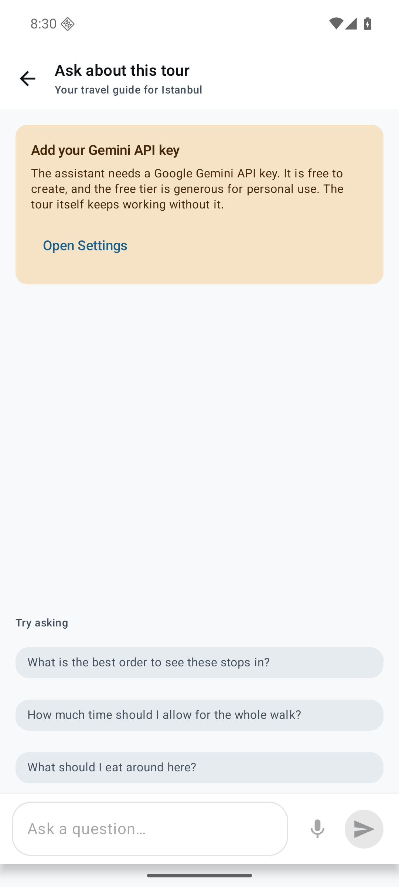 | 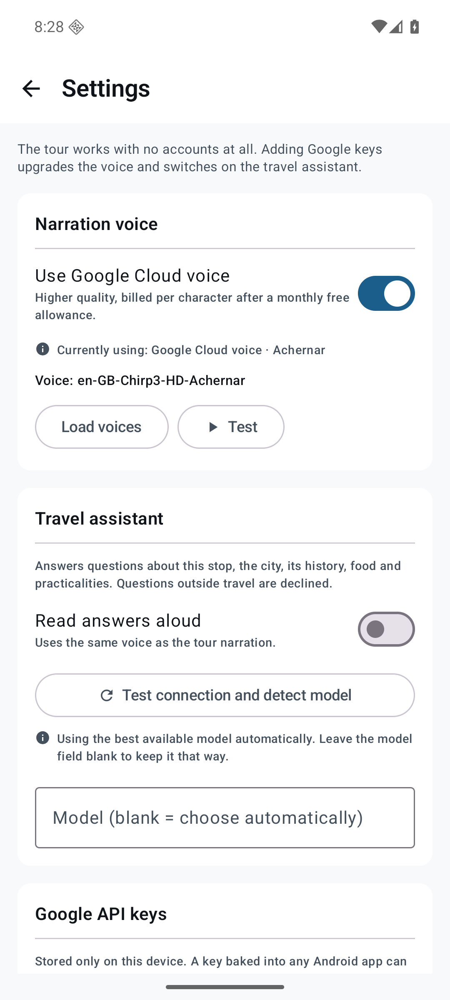 |

### Security note, stated plainly

Both keys live on the device. The app sends Google the `X-Android-Package` and `X-Android-Cert`
headers, which is what makes an "Android apps" key restriction meaningful — a key copied out of the
APK will not work from anywhere else. That is a real defence, not a formality. It is still not the
same as not shipping the key: before putting this in front of other people, move both keys behind a
small backend proxy.

---

## What has been verified

Built with AGP 9.4.1, Gradle 9.8, Kotlin 2.2.10 (AGP 9's built-in Kotlin), Compose BOM 2026.09.00,
compileSdk 37, minSdk 26. Installed and exercised end to end on an Android 36 arm64 emulator:

| Check | Result |
|---|---|
| Builds to an installable APK | ✅ debug and release both build clean, zero warnings |
| Content seeding into SQLite | ✅ `Seeded tour 'istanbul-historic-peninsula' with 14 stops` |
| App launches without crashing | ✅ |
| TTS engine initialises | ✅ `Narration engine ready=true (On-device text-to-speech)` |
| **Audio actually plays** | ✅ OS-level `AudioTrack`, `content=CONTENT_TYPE_SPEECH` |
| **Introduction plays on tour start** | ✅ `Playing`, `0 of 14 stops reached`, transcript highlighting |
| **Geofencing arms after the introduction** | ✅ `Introduction finished; geofences are now live` |
| **Geofence triggers on arrival** | ✅ `Arrived at German Fountain`, then `Arrived at Obelisk of Theodosius` |
| **Narration auto-starts on arrival** | ✅ UI showed `Playing` with no user interaction |
| Foreground service promotes correctly | ✅ `Background started FGS: Allowed` |
| Transcript highlights in sync | ✅ highlight advanced "Istanbul" → "Roman" over 14 s |
| Progress persists across stops | ✅ `2 of 14 stops reached`, ticked pins, amber next target |
| Manual jump to a stop | ✅ opened stop 5 from the list without being there |
| Distance/bearing to next stop | ✅ `36 m away to the south-west, about 1 min on foot` |
| Photo licences surfaced | ✅ `Photograph: Pedro Szekely…, CC BY-SA 2.0, via Wikimedia Commons` |
| No ANRs under stress on a real Galaxy S25 | ✅ 60 s of rapid scroll/tap/navigate with live GPS and TTS running: UI responsive, zero new ANR traces |
| Map gestures behave like a normal map | ✅ a vertical drag inside the map pans the map (changed region is exactly the map's bounds) without moving the page; a drag beside it still scrolls the page |
| Closing the app stops the audio | ✅ 1 active speech player while running → 0 after a Recents swipe and after a force-stop |
| Live Google Cloud TTS endpoint reachable in-app | ✅ real 400 from Google parsed into "Google rejected the request. API key not valid…" |
| Live Gemini endpoint reachable in-app | ✅ same, via Settings → "Test connection and detect model" |
| **Cloud failure never leaves the user in silence** | ✅ with a deliberately invalid key the tour still played: UI showed `Playing · On-device text-to-speech · cloud voice unavailable` with an active speech player |
| Chat and Settings screens render | ✅ including the no-key guidance card and suggested questions |
| **Persistent media notification** | ✅ `ONGOING_EVENT\|NO_CLEAR\|NO_DISMISS`, `category=transport`, 3 actions, artwork and stop name |
| **MediaSession drives the system media control** | ✅ `state=PLAYING, position=…, speed=1.0, actions=895` (all 9 transport actions) |
| **Transport controls actually work** | ✅ tapped the system media card: PLAYING → `PAUSED` → `PLAYING`, and next-stop reset the position to a new narration |
| Seek bar present | ✅ visible and tracking in the Quick Settings media card |
| **Join the tour at any stop** | ✅ "Start the tour from here" at the Blue Mosque began there with no introduction, and recorded `1 of 14 stops reached` |
| Nearest-stop guidance | ✅ from the Blue Mosque it pointed at the Obelisk, **133 m** — independently recalculated as the genuinely nearest unvisited stop, not route order |
| Compass heading cone | ✅ rendered and rotated using the accelerometer + magnetometer fallback (the emulator has no fused rotation vector) |
| Ask bar and chat sheet | ✅ docked bar opens the conversation over the tour without leaving it |
| Photo / map hero toggle | ✅ swipeable with tap chips; no longer stacks both |

### The Google keys, verified on a real device

Both of these were previously untested because I had no API key. With the user's own keys on their
Galaxy S25, they are now confirmed working:

| Check | Result |
|---|---|
| Cloud voice actually used | ✅ `Narration engine ready=true (Google Cloud voice · Zephyr)` |
| Cloud audio really synthesised | ✅ real MP3s on the device under `cache/cloud-tts/` (110 KB, 62 KB, …) |
| Assistant answers a real question | ✅ asked at the Basilica Cistern, answered with the Weeping Column, the Medusa heads and the carp |
| Grounding in the current stop | ✅ the answer referenced the stop the walker was standing at, not the city in general |

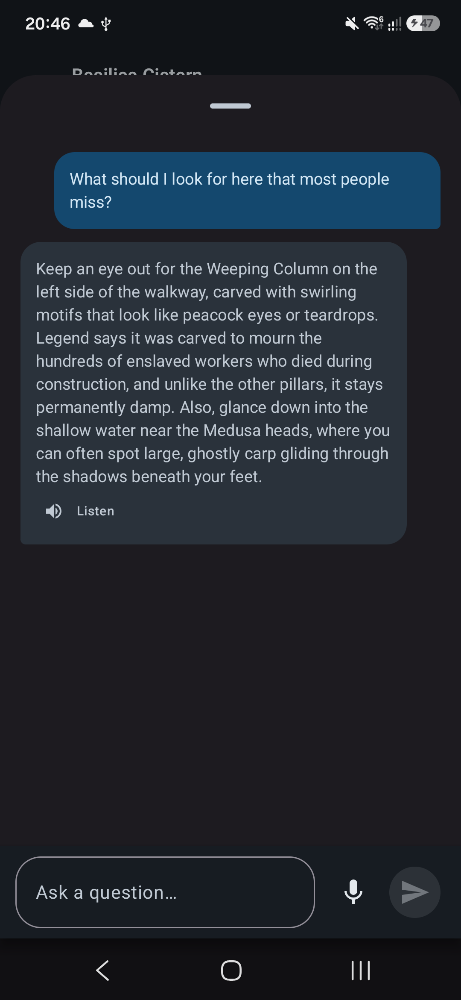

### Bugs found only by using it on the phone

Three more problems surfaced from real use that no amount of compile-testing would have caught:

1. **The docked ask bar was underneath the system navigation bar** and could not be tapped at all.
   `Scaffold` does not inset its `bottomBar`, and the emulator's gesture navigation hid the problem;
   the S25 uses 3-button navigation, whose bar occupies the bottom 144 px.
2. **The chat sheet's input row was under the navigation bar too** — `ModalBottomSheet`'s default
   inset handling did not reach it, so the sheet now manages its own insets explicitly.
3. **The sheet never opened a conversation.** `ChatBottomSheet` did not call `controller.open()`, so
   `currentKey` was null, and Send silently did nothing — no answer, no error, no suggestions. Silent
   failures like this are exactly why the feature had to be exercised by hand.

---

## Known limitations and suggested next steps

Honest about what this MVP is not:

- **Chat history is in memory only.** Conversations survive navigating between screens but not
  killing the app. Persisting them is a small Room table away.
- **The travel-only rule is a prompt, not a hard filter.** The model is instructed to decline
  off-topic questions and to offer a travel question instead, and it does so in testing of the
  prompt design — but a determined user can still get a general answer. A production build would add
  a moderation pass or a server-side allow-list.
- **Voice input uses the system recogniser dialog.** Reliable and free, but it takes over the screen
  briefly, which is slightly clunky while walking. A streaming in-app recogniser would be nicer.
- **One tour only.** The data model, seeding and UI are all multi-tour; there is simply one JSON file
  so far.
- **No offline map pre-download button.** osmdroid caches tiles as you view them, so a browsed city
  keeps working offline, but there is no explicit "download this tour" step. Worth adding, and
  straightforward — osmdroid exposes the tile cache.
- **No background location.** Geofences only fire while a tour is running (with its foreground
  service and visible notification). This is deliberate: Android requires a separate
  `ACCESS_BACKGROUND_LOCATION` grant, and continuously tracking a user outside an active tour would
  be both privacy-hostile and a Play Store policy problem. The current behaviour is the defensible
  one, but it means the app must be started before you walk.
- **Orientation filtering is off** for photographs, so EXIF-rotated images would show sideways if you
  add your own.
- **No unit tests yet.** `ArrivalDetector` and `Geo` are pure and were written to be testable; they
  would be the place to start.
- **Narration is authored, not generated.** The content is curated and fact-checked; the "AI-guided"
  part of this MVP is the adaptive guidance layer, with a clean seam for LLM-generated content.

Natural next steps, roughly in order of value: add a second city to prove the content pipeline,
add explicit offline map download, add unit tests around the geofence hysteresis, then wire the
cloud-voice adapter and an LLM content generator behind the existing seams.
